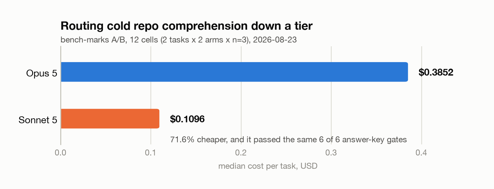
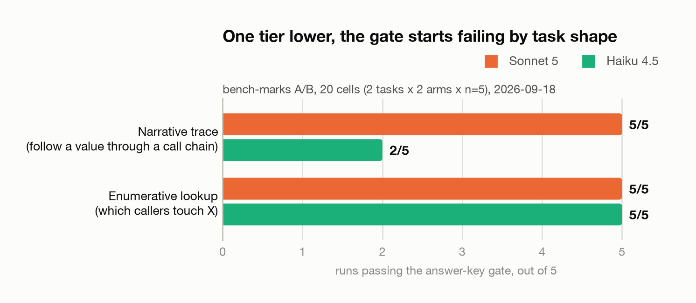
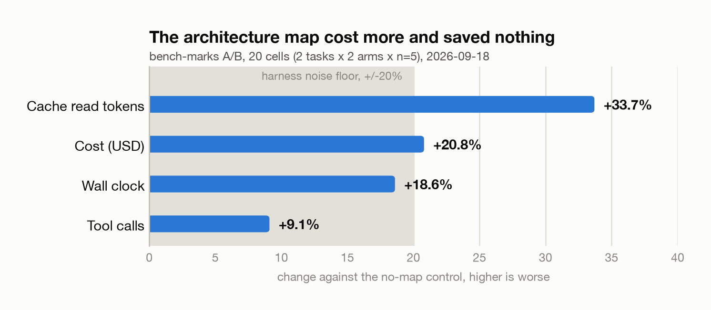

# The Bench

A personal model-evaluation harness for comparing four AI tools on identical tasks.

## Purpose

Subscription decisions are expensive guesses without data. The Bench turns a hunch ("Claude feels better at X") into a scored record. Each task brief is run independently through four tools, outputs are captured, and results are scored against a fixed rubric. The rolling dataset feeds the iTone Substack series -- a first-person account of what the four subscriptions actually do differently, week by week.

## Two kinds of experiment

The repo answers two different questions and keeps them apart, because they need
different instruments.

- **Four-tool comparisons** (`tasks/`): the same brief run through Claude,
  Codex, Cursor and Gemini, scored for quality against `rubric.md`. Answers
  "which tool is better at this".
- **A/B cost experiments** (`ab/`): one model, one change at a time, with
  correctness as a pass/fail gate rather than a score. Answers "what did the
  same correct answer cost". Findings are in [`ab/RESULTS.md`](ab/RESULTS.md);
  the method is in [`ab/README.md`](ab/README.md).

The split exists because the quality rubric saturated: two models scored 30/30
on the same task, which says the rubric cannot discriminate there, not that the
models are identical. Cost still could.

**If you are here for the numbers, start with [`ab/RESULTS.md`](ab/RESULTS.md).**

## What the numbers say so far

Five levers have been through the A/B harness, and two more are recorded as
unrunnable rather than quietly dropped. Every run carries an answer-key gate, so
a cheaper wrong answer cannot pass as a saving.

| Lever | The claim | Verdict | The number |
|---|---|---|---|
| **Model tiering** | Opus earns its price on cold repo comprehension | **Refuted, route down** | Sonnet 5 is **71.6% cheaper** and passed the same 6 of 6 gates |
| **Tiering one lower** | Haiku is cheaper still | **No** | Fails the narrative trace **3 times in 5**, and costs **75.6% more** on the shape it can do |
| **Prompt caching** | Cache the stable prefix of every turn | **Untestable here** | The CLI exposes no flag to disable caching, so there is no control arm |
| **Repo priming** | An architecture map at the top of `AGENTS.md` cuts orientation cost | **Refuted for conventional layouts** | **+20.8% cost**, tool calls flat at 9 to 10 and 2 to 2 |
| **Sub-agent hygiene** | Tell a worker to return conclusions, not file dumps | **Untestable as posed** | **0 delegations in 20 cells**, with `Agent` allowed and the instruction given |
| **Code graph** (CodeGraph) | A pre-built index beats grep on spin-up | **Retired unmeasured** | Preflight refused the run: the binary was gone, and had been for weeks |
| **Structural search** (ast-grep) | Beats regex on structural questions | **Inconclusive** | **0 invocations in 6 treatment cells**; the model used grep anyway |

The one lever that paid is unglamorous: stop sending Opus to do Sonnet's job.
Three of the five measured levers first produced a confident result that did not
survive a check of how the arms were built.

### Route down from Opus, and stop at Sonnet

<picture>
  <source media="(prefers-color-scheme: dark)" srcset="docs/img/tier-cost-dark.png">
  
</picture>

Opus 5 showed no quality advantage over Sonnet 5 on either task shape while
costing 3.5x more. Because the gate was a tie, the cost delta is real saving
rather than a cheaper wrong answer. That is the whole point of the gate: a cost
number without a quality measure beside it means nothing.

### One tier lower, the gate starts failing by task shape

<picture>
  <source media="(prefers-color-scheme: dark)" srcset="docs/img/gate-by-shape-dark.png">
  
</picture>

This is the first time the answer-key gate has separated two arms at all, and it
separates **by task shape rather than uniformly**. Haiku 4.5 is perfect on
enumerative lookup and wrong three times in five on the narrative trace.

The trap is in the arithmetic. Efficiency is only compared across runs that pass
in both arms, so on the narrative task Haiku's three failures drop the sample to
two survivors: average those and a tier that fails three times in five looks
like a bargain. On the task where the comparison is clean, Haiku is the more
expensive arm, at 75.6% above Sonnet.

### Priming the repo with an architecture map made it worse

<picture>
  <source media="(prefers-color-scheme: dark)" srcset="docs/img/priming-delta-dark.png">
  
</picture>

Tool calls were flat, so the map reduced no search at all. It was prompt weight
paid for on every turn that bought no fewer round trips. Four metrics, two
tasks, same sign throughout.

The first run of this lever reported **-34.0%** and was written up as validating
the idea. It was measuring recall, not orientation: the priming blocks named the
tasks' answer-key terms and described the relationships the tasks ask about. The
treatment arm was not oriented, it was told. `ab/bin/preflight.sh` now refuses
this lever if a priming block names one of its task's answer-key terms.

### The most durable finding is not about any one tool

Three levers, three tools, three attempts to change tool selection by making a
capability available and describing it in the system prompt:

| Lever | Offered | Instructed | Used |
|---|---|---|---|
| `ast_grep` | Binary on PATH | Named, with syntax, in the system prompt | 0 of 6 cells |
| `codegraph` | MCP registered across 40 repos | A whole skill telling agents to prefer it | Never measured; the tool was gone and nothing noticed |
| `subagent_hygiene` | `Agent` allowed, tasks built for fan-out | Told how to brief a sub-agent | 0 of 20 cells |

Availability plus instruction is not adoption. The model uses what it is used
to. That is a constraint on the method itself: a lever whose treatment is "the
model should prefer X" cannot be measured by prompt-level A/B. To measure it you
have to remove the alternative, which changes the question into a different one.

### How to read these numbers

Two grep-against-grep runs of the same configuration disagreed by 33 percentage
points, which puts the harness noise floor at roughly **+/-20% at n=3** over two
tasks. A delta smaller than that is not an effect, and the priming result sits
right on the line: what is reliable there is the direction, not the magnitude.

Scope everything to the corpus. All of it is **cold repository comprehension**
on repos of 3k to 41k lines, in two task shapes. Nothing here speaks to bulk
edits, classification or extraction, and a cheaper tier may well pay on shapes
the corpus does not contain.

The charts are rendered from the medians in `ab/RESULTS.md` by
`scripts/render-charts.py`; run it after any number changes. Raw records are one
JSON object per cell under `ab/runs/`.

## Tools under test

| Handle | Subscription | Notes |
|--------|-------------|-------|
| `claude` | Claude Max (Opus) | Orchestrator role for harness admin; also a subject under test |
| `codex` | Codex Plus | OpenAI Codex CLI in agent mode |
| `cursor` | Cursor Pro | IDE-integrated agent, Composer mode |
| `gemini` | Gemini Plus | Gemini CLI or AI Studio |

## Task-fork workflow

1. A self-contained task is identified in another repo or from scratch.
2. The task spec is copied here as `tasks/<id>/brief.md` -- no code, just the brief.
3. Each tool is given the identical brief in isolation. No tool sees another tool's output.
4. Outputs are saved to `tasks/<id>/<tool>/` (or noted if the tool produced no artefact).
5. The scorecard is completed at `tasks/<id>/scorecard.md` using the rubric in `rubric.md`.
6. A row is added to `LEDGER.md`.

The brief must be self-contained: if it requires context from the source repo, that context is pasted into the brief, not linked. This keeps comparisons fair and reproducible.

## Model policy

Work in other repos is authored as stage cards naming a worker tier and a
cross-family verifier tier, so no repo has a standing lead model. Cross-tool
comparison stays here, because a scored bake-off needs isolated arms: each tool
gets the identical brief, sees no other tool's output, and is scored post-hoc.

The one-lead-model rule this replaced was retired on 2026-06-06. See
[`MODELS.md`](MODELS.md) for the current policy and for what was dropped.

## iTone Substack series

Results are written up as posts in the iTone series "What four AI subscriptions actually do". Each post covers one or more bench tasks, shares the scorecard, and draws a narrow, data-backed conclusion. The goal is specificity: not "Claude is better" but "on deterministic algorithmic tasks under 200 lines, Claude produced working code in one pass; Cursor required three correction cycles".

## Field notes

`field-notes/` is an un-scored, narrative stream for real-project observations
that are not fair four-tool comparisons: multi-model timelines, automation
incidents, and production telemetry from the Autometta fleet. Field notes are
never scored against `rubric.md` and never appear in `LEDGER.md` -- they have
their own `field-notes/INDEX.md`. See `field-notes/README.md`.

## Repo structure

```
bench-marks/
  ab/                    A/B cost harness: levers, tasks, runs, results
    README.md            Method: gates, arms, cells, noise floor
    RESULTS.md           One section per lever -- the findings
    levers.yaml          Lever registry and status
    bin/                 preflight, run-cell, run-grid, analyse
  rubric.md              Scoring dimensions and anchors
  docs/img/              Rendered README charts, light and dark
  scripts/
    render-charts.py     Redraws docs/img from the ab/RESULTS.md medians
  MODELS.md              Worker/verifier tier policy and the routing guide
  LEDGER.md              Rolling index of all tasks
  START-PROMPT.md        Paste-ready orchestrator prompt for new tasks
  templates/
    brief-template.md    Task brief template
    scorecard-template.md Scorecard template
  field-notes/
    README.md            What the un-scored stream is for
    TEMPLATE.md          Field-note template
    INDEX.md             Rolling index, separate from LEDGER.md
  tasks/
    <task-id>/
      brief.md           The task brief (identical input to all tools)
      scorecard.md       Scored results across all four tools
      claude/            Claude output artefacts (if any)
      codex/             Codex output artefacts (if any)
      cursor/            Cursor output artefacts (if any)
      gemini/            Gemini output artefacts (if any)
```

## Licence

MIT, see [LICENSE](LICENSE). The harness, the task fixtures and the write-ups
are all reusable with attribution.

The findings are measurements of a specific corpus on specific dates, not
general claims about the models named. Several of them reversed once the
fixtures were checked, which is recorded in `ab/RESULTS.md` rather than tidied
away; read the caveats before quoting a number.
